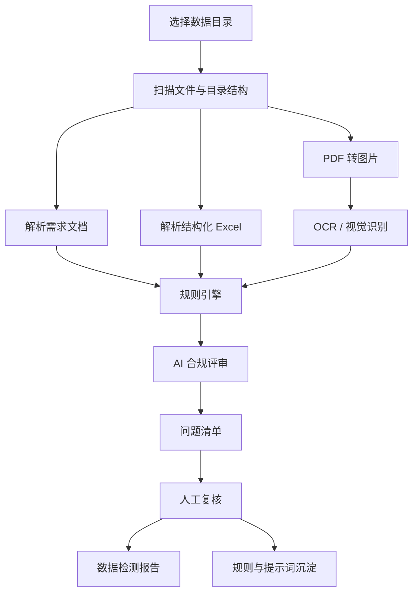

# 体检报告数据质检智能体 POC

## 1. 产品定位

本 POC 要构建一个「体检报告数据质检智能体 / 数据合规筛查工作台」。

它不是自动修复体检报告的工具，也不是直接替代人工审核。第一版只证明一件事：

> 能否把第三批体检报告数据中的不合规、疑似不合规、疑似未脱敏问题批量找出来，并生成可复核的数据评估报告。

核心价值是把原本人工逐份翻 PDF、对 Excel、看规则的工作，变成「规则 + AI + 人工复核」的批量筛查流程。

## 2. 当前数据情况

数据目录：`D:/桌面/数据/`

已观察到的数据结构：

- `体检报告需求.docx`
  - 客户需求来源。
  - 关键要求包括：`PDF + 结构化数据`、`5 年内`、`同一个人连续 3 次就诊`、`页数分布`、`异常项数量`、`检查项目丰富度`、`历史数据对比`、`是否包含总结`。
- `5人/`
  - 当前最适合做 POC 的第三批样本。
  - 包含 5 个年龄段目录：`35以下`、`35-44`、`45-54`、`56-70`、`70以上`。
  - 每个年龄段目录下有 3 个主 PDF 和 1 个 `结构化数据.xlsx`。
  - 部分目录下还有哈希命名的子目录，里面有额外 PDF，可能是同一人的报告拆分或历史报告。
- `第一批/`、`第二批/`
  - 录音里说它们应作为历史参照和评估标准来源。
  - 当前目录里疑似只有 macOS 资源叉文件，如 `._xxx`，真实评估 PDF 可能没有完整拷贝进来，需要重新确认。

对文件内容的初步判断：

- PDF 大多是图片型或扫描型 PDF，没有可靠的可抽取文字层。
- Excel 结构较干净，字段包括：
  - `ArchivesNum`
  - `DepartmentName`
  - `ItemGroupName`
  - `ItemFlag`
  - `ItemResultNum`
  - `ItemResultChar`
  - `Symbol`
  - `stand`
  - `CheckDate`

因此 POC 不能只做文本 PDF 解析，必须把「PDF 转图片 + OCR/视觉模型判读」作为核心链路。

## 3. 第一阶段目标

第一阶段只做「筛查和圈出问题」，不做自动修复。

必须做到：

1. 扫描第三批数据目录，建立文件索引。
2. 识别每个年龄段、每个档案号、PDF 和结构化 Excel 的对应关系。
3. 根据客户需求文档和历史评估结论，形成可执行规则表。
4. 对每份 PDF 和 Excel 进行批量检测。
5. 找出明显不合规、疑似不合规、疑似未脱敏的数据。
6. 输出问题清单、可能合规清单、需人工复核清单。
7. 生成一份「第三批数据检测报告」。

明确不做：

- 不凭空补缺失字段。
- 不 P 图、不改 PDF 原图。
- 不为了让数据合规而伪造内容。
- 不把疑似问题直接当成最终结论。
- 不在第一阶段做完整脱敏、重组、二次检测。

## 4. Agent 能力分层

### 4.1 文件盘点 Agent

职责：

- 扫描数据目录。
- 过滤 `.DS_Store`、`._xxx` 等无效文件。
- 识别 PDF、Excel、Word 规则文档。
- 按年龄段、档案号、文件夹结构建立数据资产清单。
- 标记缺失项，例如有 PDF 无 Excel、有 Excel 无 PDF、同一人记录不足等。

输出：

- 数据目录树。
- 文件清单。
- 人员/档案号分组。
- PDF 与 Excel 对应关系。
- 原始数据完整性问题。

### 4.2 规则抽取 Agent

职责：

- 读取 `体检报告需求.docx`。
- 提取客户最低要求。
- 将自然语言需求转为规则表。
- 如果第一批、第二批评估报告可用，则提取其中的不合规案例，补充为细化规则。

规则表字段建议：

- `rule_id`
- `rule_name`
- `source`
- `dimension`
- `check_target`
- `pass_condition`
- `fail_condition`
- `severity`
- `detect_method`
- `need_human_review`

初始规则维度：

- 用户与场景
- 格式与质量
- 内容与语义
- 历史数据对比
- 总结完整性
- 脱敏风险

### 4.3 结构化数据检测 Agent

职责：

- 解析 `结构化数据.xlsx`。
- 检查字段完整性。
- 检查每个 sheet 是否对应一个档案号。
- 统计每个档案号的检查项目、异常项数量、检查日期。
- 根据 `Symbol`、`ItemResultChar`、`stand` 判断异常项。
- 检查是否满足客户要求的项目丰富度。
- 检查是否存在历史数据对比所需的多次记录。

可自动检测的问题：

- 字段缺失。
- 档案号缺失。
- 检查日期缺失。
- 异常项数量不满足要求。
- 项目种类不足。
- 缺少指定检查项目。
- 结构化数据与 PDF 文件数量不匹配。

### 4.4 PDF/OCR 解析 Agent

职责：

- 将 PDF 转为页面图片。
- 进行 OCR 或视觉模型识别。
- 提取每页的标题、模块、检查项目、总结、医生/机构等敏感字段。
- 识别页数、版式、图片/表格存在情况。

重点检测：

- 是否包含体检总结。
- 是否包含历史数据对比。
- 是否存在内科、外科、检验、影像等关键模块。
- 报告文字中提到的图、检查、影像是否能在报告中找到。
- 是否疑似缺页。
- 是否疑似缺字、遮挡、排版错位。
- 是否存在姓名、医生名、单位、电话、身份证等疑似未脱敏信息。

### 4.5 合规评审 Agent

职责：

- 综合客户规则、Excel 检测结果、OCR 文本、PDF 页面证据。
- 对每份报告生成合规判断。
- 输出结构化 JSON，不输出只靠一句话的模糊结论。

建议输出格式：

```json
{
  "file_id": "02250201.pdf",
  "person_group": "35-44",
  "status": "needs_review",
  "issues": [
    {
      "rule_id": "R-FORMAT-001",
      "issue_type": "page_count_out_of_range",
      "severity": "medium",
      "page": 1,
      "evidence": "PDF page count is 11, requirement says medium report is 5-10 pages.",
      "confidence": 0.82,
      "need_human_review": true
    }
  ],
  "summary": "该报告存在页数边界争议，需要人工确认是否按 10+ 页长报告处理。"
}
```

### 4.6 人工复核 Agent

职责：

- 将 AI 判断呈现给人工。
- 允许人工选择：确认问题、驳回问题、改为需复核、补充备注。
- 记录不同审核人之间的判断差异。
- 将复核结论沉淀为下一轮提示词和规则。

录音中的关键原则：

- 至少 2 到 3 个人一起做。
- 客户文档是最低要求，不是所有细节的绝对答案。
- AI 和人工都会有理解偏差，偏差要显性记录。
- 判断差异要拿出来讨论，而不是隐藏在结果里。

## 5. 推荐产品页面

### 5.1 数据导入页

功能：

- 选择数据目录。
- 显示扫描进度。
- 展示发现的 PDF、Excel、Word、无效文件。
- 自动识别年龄段和档案号。

### 5.2 规则库页

功能：

- 展示从需求文档提取的规则。
- 展示从历史评估报告沉淀的规则。
- 允许人工编辑规则说明、严重程度、是否需要复核。

### 5.3 批量检测页

功能：

- 启动检测任务。
- 显示每个文件的处理状态：
  - 待处理
  - PDF 转图中
  - OCR 中
  - 规则检测中
  - AI 评审中
  - 需人工复核
  - 完成
- 展示总进度和失败原因。

### 5.4 问题清单页

功能：

- 按问题类型、严重程度、年龄段、文件、规则筛选。
- 显示问题证据。
- 支持批量标记复核状态。

表格字段：

- 文件名
- 年龄段
- 档案号
- 问题类型
- 命中规则
- 页码
- 证据摘要
- 置信度
- 严重程度
- 复核状态

### 5.5 单报告详情页

这是 POC 最关键的页面。

布局建议：

- 左侧：PDF 页面截图和页码。
- 中间：OCR 文本、结构化数据、命中规则。
- 右侧：AI 判断、证据、人工复核操作。

目标：

- 让客户看到 AI 不是在空口判断。
- 每个问题都能回到具体文件、具体页、具体字段。

### 5.6 报告导出页

功能：

- 导出数据检测报告。
- 导出不合规清单。
- 导出可能合规清单。
- 导出需人工复核清单。
- 导出规则命中统计。

## 6. 后端模块设计

建议沿用当前项目的 FastAPI 后端和 Next.js 前端，不重起一套。

### 6.1 数据模型

核心表：

- `datasets`
- `files`
- `persons`
- `reports`
- `rules`
- `checks`
- `issues`
- `review_decisions`
- `agent_runs`

### 6.2 服务模块

建议模块：

- `services/dataset_scanner.py`
- `services/docx_rule_parser.py`
- `services/xlsx_parser.py`
- `services/pdf_renderer.py`
- `services/ocr_provider.py`
- `services/rule_engine.py`
- `services/ai_reviewer.py`
- `services/report_exporter.py`

### 6.3 处理流程



## 7. 第一版检测规则建议

### 7.1 文件完整性

- 每个年龄段目录是否存在。
- 每个年龄段是否有 3 个主 PDF。
- 每个年龄段是否有 1 个结构化 Excel。
- Excel sheet 数是否与主 PDF 数量一致。
- PDF 文件是否能打开。
- PDF 页数是否能读取。

### 7.2 客户需求符合度

- 是否 PDF + 结构化数据。
- 是否存在同一人连续 3 次记录。
- 是否在 5 年内。
- 页数是否满足 5-10 页或 10+ 页分布。
- 是否有总结。
- 是否有历史数据对比。
- 是否包含要求中的特殊项目，如肿瘤标志物、基因检查、钼靶等。

### 7.3 内容完整性

- 是否缺少常规内科检查。
- 是否缺少常规外科检查。
- 是否缺少检验类项目。
- 是否缺少影像类项目。
- 报告文字引用的检查图、影像、表格是否存在。

### 7.4 异常项检测

- 根据 Excel 的 `Symbol` 标记异常项。
- 根据 `ItemResultChar` 识别阳性、异常、结节、囊肿、增厚、偏高、偏低等描述。
- 统计每份报告异常项数量。
- 与客户需求中的异常项比例要求对照。

### 7.5 脱敏风险

- 是否出现姓名。
- 是否出现身份证号。
- 是否出现手机号。
- 是否出现医生姓名。
- 是否出现单位名称。
- 是否出现机构内部编号。
- 是否出现可识别个人身份的组合信息。

注意：第一阶段只标记疑似未脱敏内容，不执行脱敏。

## 8. 交付物

POC 第一版建议交付：

1. 数据资产清单
2. 规则库
3. 批量检测结果
4. 不合规问题清单
5. 可能合规数据清单
6. 需人工复核清单
7. 人工复核记录
8. 第三批数据检测报告
9. AI 提示词与规则说明

## 9. 验收标准

POC 成功标准：

- 能完整扫描 `5人` 样本目录。
- 能识别 PDF、Excel、年龄段、档案号之间的关系。
- 能读取需求文档并生成初始规则表。
- 能解析结构化 Excel。
- 能统计 PDF 页数。
- 能对 PDF 页面进行 OCR 或视觉识别。
- 能检测至少 5 类问题：
  - 文件或结构缺失
  - 页数/格式异常
  - 检查项目不足
  - 缺少总结或历史对比
  - 疑似未脱敏
- 每个问题都有证据。
- 人工可以复核 AI 判断。
- 能导出一份可交付的数据检测报告。

## 10. 后续阶段

第一阶段完成后，再考虑第二阶段：

- 自动脱敏。
- 数据重组。
- 脱敏后复检。
- 多轮规则学习。
- 历史评估报告自动吸收。
- 大批量 2000 人 / 10000 份报告处理。

第二阶段的前提是第一阶段已经证明：

1. 能可靠发现问题。
2. 能解释为什么是问题。
3. 人工认可检测结果有参考价值。
4. 检测流程能沉淀为规则和提示词。

## 11. 产品原则

- 先筛查，后修复。
- 先证据，后结论。
- 先人工复核，后自动化闭环。
- 客户文档是最低要求，历史评估结果是重要参照。
- AI 判断必须可追溯，不能只输出泛泛结论。
- 不凭空补数据，不伪造合规。
- 争议判断要记录，逐步沉淀为规范。
