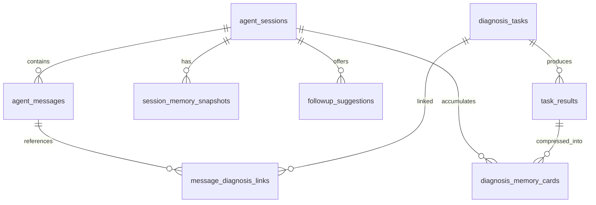

# Continuous Conversation Agent Design

Date: 2026-06-13
Status: Draft for review
Scope: Store AI Clinic continuous conversation agent for the existing Next.js + FastAPI system

## 1. Summary

The current system supports:

- Uploading daily reports
- Uploading weekly reports
- Generating a diagnosis report

The current agent interaction is still single-turn:

1. User uploads data
2. System generates one diagnosis
3. Interaction ends

This design upgrades the product to a continuous conversation agent so users can keep asking follow-up questions about the same operating problem without restarting the workflow.

Example target interaction:

1. User: Analyze Hangzhou West Lake store
2. Agent: Revenue is down 12%
3. User: Why is it down?
4. Agent: Traffic is down 8%, average order value is down 4%
5. User: Which hours declined most?
6. Agent: 14:00-17:00 declined the most
7. User: Generate a correction plan for the store manager
8. Agent: Returns an action plan

## 2. Product Goal

Enable users to explore the same store operating issue through multi-turn dialogue while preserving the calm, action-oriented product tone defined in [PRODUCT.md](D:\桌面\门店数据诊断\PRODUCT.md).

The upgraded agent must support:

- Follow-up questions
- Same-store over-time comparison
- Session summaries
- Deeper analysis on demand
- Automatic citation of relevant historical diagnoses

## 3. Confirmed Product Decisions

The following decisions were confirmed during design:

- Session creation mode: hybrid
  - A diagnosis can auto-create a session
  - A user can also manually create an empty session
- Long-term memory scope for V1: diagnosis history only
  - No raw report fulltext memory
  - No knowledge-base memory in V1
- Comparison scope for V1: same store over time only
- Follow-up suggestion style: conservative
  - Return 2-3 suggested next questions
  - Do not proactively expand analysis unless the user asks

## 4. Non-goals

This phase does not include:

- Cross-store comparison
- A full vector-memory platform
- Automatic ingestion of all raw daily or weekly report contents into long-term memory
- Replacing the existing diagnosis engine
- Turning the primary UI back into an admin-style workflow monitor

## 5. Current System Constraints

The design must fit the existing codebase:

- Next.js frontend workspace: `store-ai-clinic-web/`
- FastAPI backend workspace: `src/store_ai_clinic/`
- Existing single-run diagnosis entrypoint:
  - Next.js BFF: `/api/agent/run`
  - FastAPI endpoint: `/api/diagnosis/run`
- Existing backend task models:
  - `diagnosis_tasks`
  - `task_results`

The design should preserve the current diagnosis flow as a reusable deep-analysis tool, not rewrite it into a chat engine.

## 6. Recommended Architecture

### 6.1 Architectural choice

Recommended approach: add a conversation orchestration layer around the existing diagnosis engine.

Why this is recommended:

- Reuses the current FastAPI diagnosis workflow with minimal disruption
- Lets chat, memory, comparison, and summaries evolve independently from the single-run diagnosis flow
- Keeps debugging and ownership boundaries clear
- Delivers V1 faster with less regression risk

### 6.2 Major layers

1. Conversation Orchestrator
2. Diagnosis Engine
3. Memory and compression services
4. Next.js conversation UI and BFF

### 6.3 Responsibility split

Conversation Orchestrator:

- Creates and loads sessions
- Accepts user messages
- Builds per-turn context
- Retrieves session memory and historical diagnosis memory
- Classifies user intent
- Decides whether to answer directly or trigger a fresh diagnosis
- Generates response text and follow-up suggestions
- Writes messages and memory snapshots

Diagnosis Engine:

- Runs a single structured diagnosis against store context
- Produces diagnosis draft output
- Remains the deep-analysis backend tool used by the orchestrator

## 7. Memory Model

### 7.1 Conversation Memory

Purpose: answer the current turn.

Content:

- Current user message
- Recent messages from the same session
- Current referenced diagnosis outputs
- Temporary slots inferred for this turn
  - store
  - time range
  - diagnosis focus
  - comparison mode

Properties:

- Short-lived
- Dynamically assembled for each request
- Highest relevance, shortest retention

### 7.2 Session Memory

Purpose: preserve continuity for the same operating issue across multiple turns.

Content:

- Session title
- Current store and time range
- Confirmed findings
- Open questions
- Latest conclusion
- Suggested next analysis directions
- Milestone summaries for long sessions

Properties:

- Stable within one session
- Updated after important turns
- Used to inherit context without forcing the user to repeat themselves

### 7.3 Long-term Memory

Purpose: allow the agent to reuse historical diagnosis knowledge.

V1 scope:

- Historical session summaries
- Historical diagnosis summaries
- Historical root-cause conclusions
- Historical action recommendations

Excluded in V1:

- Raw uploaded report fulltext as long-term memory
- Knowledge-base documents
- Brand rules as long-term memory

### 7.4 Memory retrieval policy

V1 retrieval prioritizes precision over recall:

1. Filter by `store_id`
2. Filter or rank by same diagnosis type when helpful
3. Rank by time proximity
4. Rank by topic or tags
5. Return top 1-3 relevant memory cards only

## 8. Context Compression

### 8.1 Compression objectives

- Prevent prompt bloat in long sessions
- Preserve decision-relevant context
- Keep prompts grounded and cheap enough to run repeatedly

### 8.2 Compression strategy

1. Rolling message summary
2. Diagnosis memory card extraction
3. Historical retrieval compression

### 8.3 Rolling message summary

Trigger conditions:

- Session exceeds 10 messages
- Estimated prompt token usage crosses threshold
- A milestone event happens
  - diagnosis completed
  - compare result completed
  - explicit user summary

Compression output must preserve:

- Store identity
- Current time range
- Confirmed findings
- Open questions
- Important prior recommendations
- Which historical diagnoses have already been referenced

### 8.4 Diagnosis memory cards

Each completed diagnosis should also generate a compact memory card containing:

- Store and time scope
- Title
- Summary
- Root-cause brief
- Next-action brief
- Tags
- Importance score

### 8.5 Historical retrieval compression

Historical memory should be injected as compressed memory cards, not raw full reports.

Rules:

- Max 3 memory cards per turn
- Prefer same store
- Prefer recent or strongly matching prior patterns
- Keep each memory card concise enough for prompt use

## 9. Follow-up Question Engine

### 9.1 Product stance

V1 is conservative.

The agent should:

- Return 2-3 suggested next questions
- Not force additional analysis
- Avoid noisy or repetitive suggestion lists

### 9.2 Suggestion categories

1. Clarify
2. Deepen
3. Action

Examples:

- Do you want me to keep breaking down why the decline happened?
- Do you want me to check which time periods dropped the most?
- Do you want me to generate a store-manager action plan?

### 9.3 Suggestion rules

- At least one suggestion should deepen the current topic
- At least one suggestion should move toward action or summary
- Suggestions must be grounded in the current session state
- Suggestions should avoid repeating the exact same wording from the previous turn

## 10. Multi-turn Dialogue Flow

### 10.1 High-level flow

1. User enters or continues a session
2. Frontend sends the message to the conversation API
3. Orchestrator loads session context
4. Orchestrator assembles conversation memory
5. Orchestrator retrieves relevant historical diagnosis memory
6. Intent router classifies the user request
7. Orchestrator decides one of the following:
   - direct answer
   - trigger a new diagnosis
   - same-store comparison
   - session summary
8. Agent response is generated
9. Follow-up suggestions are generated
10. Messages and snapshots are persisted
11. Frontend renders reply plus suggestions

### 10.2 Supported V1 intents

1. `initial_diagnosis`
2. `why_followup`
3. `time_drilldown`
4. `action_plan`
5. `session_summary`
6. `same_store_compare`

### 10.3 Intent inheritance rules

If the user asks a short follow-up like "Why did it drop?" the orchestrator should inherit:

- `store_id` from the active session
- `time_range` from the active session
- `current topic` from the latest session memory snapshot

The system should not ask the user to repeat these unless the session context is actually ambiguous.

## 11. Database Design

Keep existing tables:

- `diagnosis_tasks`
- `task_results`

Add six new tables.

### 11.1 `agent_sessions`

Purpose: one row per continuous business-problem session.

Suggested fields:

- `session_id` PK
- `brand_id`
- `store_id`
- `session_title`
- `status`
- `entry_mode`
- `primary_topic`
- `diagnosis_type_hint`
- `biz_date_start`
- `biz_date_end`
- `last_user_message_at`
- `last_agent_message_at`
- `created_by`
- `created_at`
- `updated_at`

### 11.2 `agent_messages`

Purpose: stores all user and assistant messages.

Suggested fields:

- `message_id` PK
- `session_id` FK
- `role`
- `message_type`
- `content_text`
- `content_json`
- `reply_to_message_id`
- `intent_label`
- `tokens_estimate`
- `created_at`

### 11.3 `session_memory_snapshots`

Purpose: stores compressed session summaries.

Suggested fields:

- `snapshot_id` PK
- `session_id` FK
- `summary_text`
- `summary_json`
- `coverage_message_start_id`
- `coverage_message_end_id`
- `compression_level`
- `created_at`

Recommended `summary_json` contents:

- `store_id`
- `time_range`
- `confirmed_findings`
- `open_questions`
- `latest_conclusion`
- `recommended_next_steps`

### 11.4 `diagnosis_memory_cards`

Purpose: stores compact historical diagnosis memory for retrieval.

Suggested fields:

- `memory_id` PK
- `source_task_id` FK
- `source_result_id` FK
- `session_id` FK nullable
- `brand_id`
- `store_id`
- `diagnosis_type`
- `biz_date_start`
- `biz_date_end`
- `title`
- `summary`
- `root_cause_brief`
- `next_action_brief`
- `tags_json`
- `importance_score`
- `created_at`

### 11.5 `message_diagnosis_links`

Purpose: links conversation turns to the diagnosis tasks they triggered or referenced.

Suggested fields:

- `id` PK
- `session_id` FK
- `message_id` FK
- `task_id` FK
- `link_type`
- `created_at`

### 11.6 `followup_suggestions`

Purpose: stores the suggestions displayed after each assistant turn.

Suggested fields:

- `suggestion_id` PK
- `session_id` FK
- `message_id` FK
- `suggestion_text`
- `suggestion_type`
- `rank_order`
- `accepted`
- `created_at`

### 11.7 Relationship summary



### 11.8 Indexing recommendations

- `agent_sessions(store_id, updated_at desc)`
- `agent_messages(session_id, created_at)`
- `session_memory_snapshots(session_id, created_at desc)`
- `diagnosis_memory_cards(store_id, created_at desc)`
- `diagnosis_memory_cards(store_id, diagnosis_type, biz_date_start, biz_date_end)`
- `message_diagnosis_links(session_id, message_id)`

## 12. API Design

### 12.1 API design principles

- Preserve the current diagnosis API as a reusable tool API
- Add a dedicated conversation API for multi-turn dialogue
- Keep Next.js BFF as the browser-facing API layer

### 12.2 FastAPI conversation endpoints

#### `POST /api/conversations/sessions`

Creates a session.

Example request:

```json
{
  "store_id": "hangzhou-xihu",
  "brand_id": "brand-acme",
  "entry_mode": "manual",
  "initial_question": "Analyze Hangzhou West Lake store",
  "diagnosis_type_hint": "daily"
}
```

Example response:

```json
{
  "session_id": "ses_001",
  "session_title": "Hangzhou West Lake Store Analysis",
  "status": "active",
  "first_message_id": "msg_001"
}
```

#### `GET /api/conversations/sessions`

Returns session list with filtering by:

- `store_id`
- `status`
- `cursor`
- `limit`

#### `GET /api/conversations/sessions/{session_id}`

Returns:

- session metadata
- latest memory snapshot
- latest linked diagnoses
- latest follow-up suggestions

#### `GET /api/conversations/sessions/{session_id}/messages`

Paginated message history for the session.

#### `POST /api/conversations/sessions/{session_id}/messages`

Primary multi-turn conversation endpoint.

Example request:

```json
{
  "content": "Why did it drop?",
  "client_context": {
    "selected_compare_mode": "same_store_over_time"
  }
}
```

Example response:

```json
{
  "session_id": "ses_001",
  "user_message_id": "msg_010",
  "assistant_message": {
    "message_id": "msg_011",
    "content_text": "Traffic is down 8% and average order value is down 4%."
  },
  "used_memories": [
    {
      "memory_id": "mem_001",
      "reason": "same_store_recent_diagnosis"
    }
  ],
  "triggered_diagnosis_task": {
    "task_id": "task_2002",
    "triggered": true
  },
  "followup_suggestions": [
    "Do you want me to check which time periods declined the most?",
    "Do you want me to compare this with the same day last week?",
    "Do you want me to turn this into a store-manager action plan?"
  ]
}
```

#### `POST /api/conversations/sessions/{session_id}/summary`

Generates a summary for the current session.

#### `GET /api/conversations/sessions/{session_id}/memories`

Returns diagnosis memories referenced by the session.

#### `POST /api/conversations/sessions/{session_id}/compare`

Supports same-store over-time comparison only.

Example request:

```json
{
  "compare_type": "same_store_over_time",
  "left": {
    "date_start": "2026-06-01",
    "date_end": "2026-06-07"
  },
  "right": {
    "date_start": "2026-06-08",
    "date_end": "2026-06-14"
  }
}
```

### 12.3 Existing diagnosis API evolution

Keep:

- `POST /api/diagnosis/run`

Allow future optional request fields:

- `session_id`
- `analysis_mode`
- `trigger_reason`

This preserves backwards compatibility while making the diagnosis engine more useful as a conversation tool.

### 12.4 Next.js BFF endpoints

Add:

- `POST /api/conversations/sessions`
- `GET /api/conversations/sessions`
- `GET /api/conversations/sessions/[sessionId]`
- `GET /api/conversations/sessions/[sessionId]/messages`
- `POST /api/conversations/sessions/[sessionId]/messages`
- `POST /api/conversations/sessions/[sessionId]/summary`
- `POST /api/conversations/sessions/[sessionId]/compare`

## 13. Prompt Design

### 13.1 Prompt layering

Do not use one giant prompt. Split prompts into:

1. System prompt
2. Session context prompt
3. Retrieved memory prompt
4. Task instruction prompt

### 13.2 System prompt responsibilities

- Define the assistant as a store operations analysis partner
- Prioritize decision-ready guidance
- Avoid exposing workflow internals
- Prevent hallucinated historical references
- Inherit current session scope when possible
- Return concise, practical follow-up suggestions

### 13.3 Session context prompt contents

- Session title
- Active store
- Active time range
- Current topic
- Confirmed findings
- Open questions
- Current user question

### 13.4 Retrieved memory prompt contents

Only inject top relevant historical diagnosis memory cards.

Each card should contain:

- time
- store
- diagnosis conclusion
- action recommendation
- reason for relevance

### 13.5 Task instruction prompt

One prompt mode per turn, for example:

- `answer_why_followup`
- `answer_time_drilldown`
- `generate_action_plan`
- `summarize_session`
- `compare_same_store_over_time`

### 13.6 Structured response format

Recommend JSON output for the conversation layer:

```json
{
  "answer": {
    "headline": "Revenue decline is primarily driven by lower traffic",
    "summary": "Based on the current diagnosis, the main driver is an 8% traffic decline, with a 4% average order value decline adding more pressure.",
    "bullets": [
      "Traffic decline is the primary driver",
      "Average order value decline worsened the outcome",
      "Historical diagnosis suggests the afternoon time band may need more attention"
    ],
    "next_action": "The next best step is to break down the 14:00-17:00 traffic and conversion changes."
  },
  "memory_references": [
    {
      "memory_id": "mem_001",
      "reference_reason": "same_store_recent_pattern"
    }
  ],
  "followup_suggestions": [
    "Do you want me to check which time periods dropped the most?",
    "Do you want me to compare this with the same day last week?",
    "Do you want me to generate a store-manager action plan?"
  ]
}
```

### 13.7 Intent classification output

Recommend a light classifier result:

```json
{
  "intent": "why_followup",
  "inherit_store_id": true,
  "inherit_time_range": true,
  "need_history_lookup": true,
  "need_new_diagnosis": false,
  "need_same_store_compare": false
}
```

## 14. Next.js UI Design

### 14.1 Product direction

Upgrade the current `Agent` page from upload-first single-run analysis into a conversation-first workspace.

The UI should stay aligned with the product tone:

- calm
- trustworthy
- action-oriented
- not dashboard-heavy

### 14.2 Main page structure

Recommended layout:

- Left column: session list
- Center column: conversation thread
- Right column: evidence, memory references, and suggested next questions

### 14.3 Session entry modes

Support both:

- auto-created session from diagnosis start
- manual new session from user action

### 14.4 New frontend components

Recommended additions:

- `ConversationThread`
- `ChatComposer`
- `AssistantAnswerCard`
- `FollowupSuggestionChips`
- `MemoryReferencePanel`
- `SessionListPanel`

### 14.5 Upload behavior

Keep upload, but make it session-aware:

- files attach to the active session
- user can upload before or during the conversation
- upload alone should not define the whole interaction model

### 14.6 Role of Tasks page

`Tasks` should remain available but shift to:

- diagnosis result center
- evidence lookup surface
- linked results for conversation sessions

`Agent` becomes the primary interaction entrypoint.

### 14.7 Frontend state design

Recommended state slices:

- `conversation-list-store`
- `conversation-thread-store`
- `conversation-runtime-store`

### 14.8 Recommended routes

- `/agent`
- `/agent/[sessionId]`
- `/tasks`
- `/tasks/[taskId]`

## 15. FastAPI Implementation Plan

### 15.1 New routers

Recommend adding:

- `api/routers/conversations.py`
- optionally split later into:
  - `conversation_messages.py`
  - `conversation_compare.py`

### 15.2 New schemas

Recommend adding:

- `schemas/conversations.py`
- `schemas/messages.py`
- `schemas/memories.py`

### 15.3 New models

Recommend adding:

- `models/conversations.py`

Containing:

- `AgentSession`
- `AgentMessage`
- `SessionMemorySnapshot`
- `DiagnosisMemoryCard`
- `MessageDiagnosisLink`
- `FollowupSuggestion`

### 15.4 New services

Recommend adding:

- `services/conversation_sessions.py`
- `services/conversation_messages.py`
- `services/conversation_memory.py`
- `services/diagnosis_memory.py`
- `services/followups.py`
- `services/intent_router.py`
- `services/orchestrator.py`
- `services/conversation_llm.py`

### 15.5 Orchestrator entrypoint

Recommend a core backend function:

```python
def handle_conversation_turn(
    *,
    session_id: str,
    user_text: str,
    client_context: dict | None = None,
) -> ConversationTurnResult:
    ...
```

### 15.6 Internal turn processing steps

1. Load session
2. Persist user message
3. Load recent messages
4. Load latest session snapshot
5. Retrieve relevant diagnosis memory cards
6. Run intent classification
7. Choose execution path
8. Generate response
9. Generate follow-up suggestions
10. Persist assistant message
11. Update snapshot or memory cards if needed
12. Return response DTO

### 15.7 Existing diagnosis service adaptation

Keep the current service and extend its signature carefully:

```python
def run_diagnosis_task(
    *,
    task_id: str,
    store_id: str,
    diagnosis_type: str,
    context: str,
    session_id: str | None = None,
    analysis_mode: str | None = None,
    trigger_reason: str | None = None,
) -> dict[str, object]:
    ...
```

This keeps the diagnosis engine reusable while allowing the orchestrator to explain why a diagnosis run was triggered.

## 16. Error Handling

### 16.1 User-facing behavior

The UI should avoid raw backend failure noise in the primary chat surface.

If a deep diagnosis call fails:

- The assistant should still respond with a conservative fallback
- The response should say that the answer is based on currently available diagnosis context
- The system may suggest retrying deeper analysis

### 16.2 Backend handling

The orchestrator should:

- distinguish intent classification failure from diagnosis execution failure
- preserve session continuity even if one deep-analysis turn fails
- store enough internal metadata for diagnostics without exposing it in the main UI

### 16.3 Retrieval failure

If historical memory retrieval fails:

- continue with current-session context only
- do not pretend historical evidence was retrieved

## 17. Testing Strategy

### 17.1 Backend tests

Add unit tests for:

- intent routing
- session context inheritance
- history retrieval ranking
- compression behavior
- follow-up suggestion generation

Add integration tests for:

- create session -> send first message -> diagnosis triggered
- send short follow-up -> inherited store and time range
- same-store compare path
- session summary path
- diagnosis fallback path on LLM or tool failure

### 17.2 Frontend tests

Add unit tests for:

- session list rendering
- thread rendering
- follow-up suggestion chips
- session route loading
- message composer submission behavior

Add integration tests for:

- creating a new session
- continuing an existing session
- clicking a follow-up suggestion
- switching sessions without losing the selected thread state

### 17.3 Manual verification

Verify these end-to-end scenarios locally:

1. Start an analysis session from the Agent page
2. Ask "Why did it drop?"
3. Ask "Which hours declined most?"
4. Ask for an action plan
5. Ask for a summary
6. Re-open the same session and confirm continuity

## 18. Rollout Plan

### Phase 1: Session skeleton

- Add session and message persistence
- Add session list and thread UI
- Make session creation and message posting work end-to-end

### Phase 2: Orchestration

- Add intent routing
- Add orchestrator service
- Reuse existing diagnosis engine as a tool

### Phase 3: Memory

- Add session snapshots
- Add diagnosis memory cards
- Add automatic historical diagnosis citation

### Phase 4: Experience refinement

- Add same-store over-time compare path
- Improve follow-up suggestions
- Improve evidence side panel and summary UX

## 19. Risks and Controls

### Risk 1: Context drift

Problem:

- Agent forgets the active store or time range during a long conversation

Control:

- force `store_id` and `time_range` into every session memory snapshot

### Risk 2: Unnecessary diagnosis reruns

Problem:

- The system triggers deep diagnosis too often, increasing cost and latency

Control:

- intent router decides whether current evidence is sufficient before calling the diagnosis engine

### Risk 3: Weak historical grounding

Problem:

- The model invents historical references or overstates past findings

Control:

- all historical references must come from stored diagnosis memory cards

### Risk 4: UI regression into admin-console language

Problem:

- conversation surfaces begin exposing raw technical internals

Control:

- keep diagnosis IDs, graph stage, and raw backend details out of the primary chat UI
- preserve the product tone defined in [PRODUCT.md](D:\桌面\门店数据诊断\PRODUCT.md)

## 20. Final Recommendation

Proceed with a conversation orchestration layer wrapped around the existing diagnosis engine.

This is the best fit for the current repository because it:

- preserves the existing diagnosis backend as a strong reusable core
- adds multi-turn continuity without rewriting the stable single-run workflow
- supports follow-up, summary, deep analysis, and same-store comparison in a staged way
- aligns with the current Next.js product direction instead of returning to a tool-console experience

## 21. Implementation Readiness

This design is implementation-ready for a phased build.

The first implementation plan should focus on:

1. session and message persistence
2. conversation API and BFF
3. frontend conversation shell
4. orchestrator integration with the existing diagnosis engine

Only after that should the work expand into:

- historical memory cards
- compare flow
- more advanced compression and retrieval ranking
